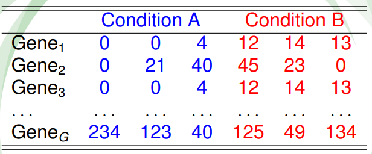
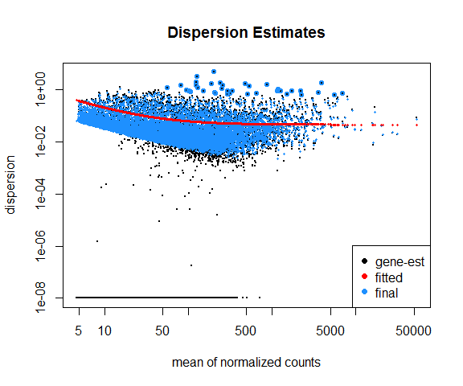
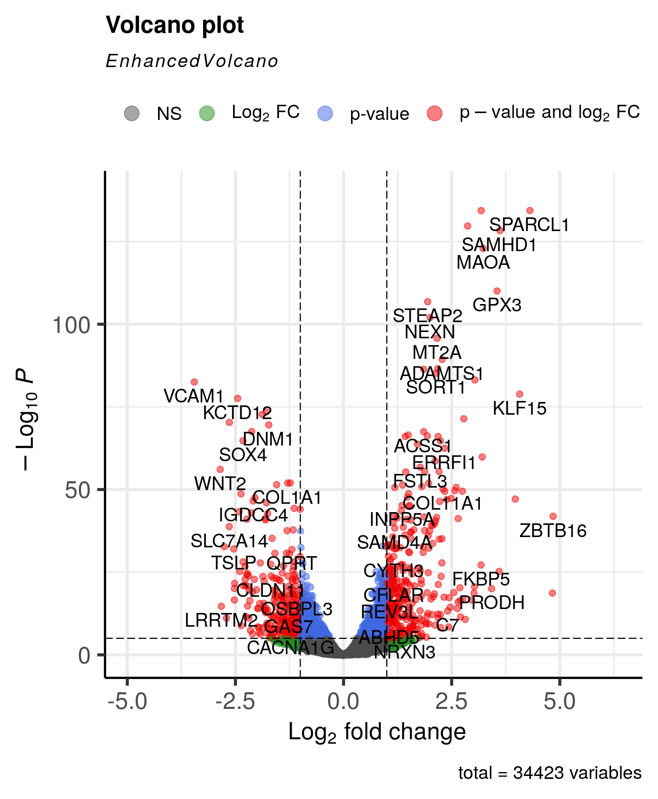

# RNAseq data analysis

In this chapter we will assume that the data analyst has obtained a read count table from raw fastq reads obtained from an Illumina sequencing run. This can also be performed using Bioconductor R packages, but sometimes you can ask the core facility for this data since it can be very computational expensive. Here we demonstrate how to process the count table, make a case-control differential expression analysis, and do some downstream functional enrichment analysis that can also be applied to the results obtained from microarrays experiments.


## Introduction

The transcription profile of a particular gene follows from counting the number of times the transcripts of the genes were mapped by sequenced reads. The summarized RNA-seq data is known as count data. Figure \@ref(fig:RNAseq) describes the main steps that are taken to obtain the count table that measures the transcription of active genes in biological samples. 


```{r RNAseq, fig.cap='RNA-seq scheme to get count data.', out.width='120%', fig.align='center', echo=FALSE}
knitr::include_graphics('figures/counts_scheme_3.png')
```


The sequenced reads can be counted in a number of different ways:

- By alignment to the genome and summarized at either gene or transcript (isoform) level.
- By alignment to the transcriptome and summarized at either gene or transcript (isoform) level.
- By assembling directly into transcripts and summarized at either gene or transcript (isoform) level.

Table \@ref(fig:counts) shows a hypothetical RNA-seq data of $G$ genes obtained for 6 samples, belonging to two different conditions. The main goal is to discover the genes that are differentially expressed between individuals from condition A and B. 

```{r counts, fig.cap='Table of counts for an hypotethical data example.', out.width='70%', fig.align='center', echo=FALSE}

```


In RNA-seq analysis, we deal with the number of reads (**counts**) that map to the biological feature of interest (gene, transcript, exon, etc.). The count number depends linearly with the abundance of the target's transcription because the sequencing of RNA is a direct measure of transcription. This is considered as one of the advantages over microarrays\index{subjectindex}{Microarray} that indirectly measure transcription by hybridization. Figure \@ref(fig:microVSrnaseq) illustrates the type of data from microarray and RNA-seq experiments. While microarray data is continuous, RNA-seq is discrete and, therefore, the modeling of each type of data is different. 

```{r microVSrnaseq, echo=FALSE, fig.cap="Gene expression distribution obtained from RNA-seq and microarray data from a hypothetical gene.", fig.align='center'}
  
dd <- rnbinom(10000, mu=2, size=100)
dd2 <- rnorm(10000, mean=15, sd=8)

par(mfrow=c(1,2))
plot(prop.table(table(dd)), type="h", lwd=4,  
     main="RNAseq data", xlab="counts",  
     ylab="Probability")

plot(density(dd2), main="Microarray data", xlab="intensity", 
     lwd=3, col="gray90")
```


There are two important factors that influence the number of gene counts and which need to be taken into account, see figure \@ref(fig:rnaseqParts). The first factor is the **sequencing depth** or **library size**, that is, the total number of reads mapped to the genome; the second factor is the **gene length**, i.e. the number of bases covering a gene. It is expected that larger genes, for a given level of transcription, will have more gene counts.

```{r rnaseqParts, fig.cap='Key concepts involved in an RNA-seq experiment.', out.width='100%', fig.align='center', echo=FALSE}
knitr::include_graphics('figures/rnaseq_parts.png')
```

## Within sample normalization of read counts

The most common application after a gene’s expression is quantified (as the number of reads aligned to the gene), is to compare the gene’s expression in different conditions, for instance, in a case-control setting (e.g. disease versus normal) or in a time-series (e.g. along different developmental stages). Making such comparisons helps identify the genes that might be responsible for a disease or an impaired developmental trajectory. However, there are multiple caveats that needs to be addressed before making a comparison between the read counts of a gene in different conditions ([Maza, et al. 2013](https://www.tandfonline.com/doi/full/10.4161/cib.25849)).

Library size (i.e. sequencing depth) varies between samples coming from different lanes of the flow cell of the sequencing machine.
Longer genes will have a higher number of reads.
Library composition (i.e. relative size of the studied transcriptome) can be different in two different biological conditions.
GC content biases across different samples may lead to a biased sampling of genes. 


The most basic normalization approaches address the sequencing depth bias. Such procedures normalize the read counts per gene by dividing each gene’s read count by a certain value and multiplying it by $10^6$. These normalized values are usually referred to as CPM (counts per million reads):

- Total Counts Normalization (divide counts by the **sum** of all counts)
- Upper Quartile Normalization (divide counts by the **upper quartile** value of the counts)
- Median Normalization (divide counts by the **median** of all counts)

Popular metrics that improve upon CPM are RPKM/FPKM (reads/fragments per kilobase of million reads) and TPM (transcripts per million). RPKM is obtained by dividing the CPM value by another factor, which is the length of the gene per kilobase. FPKM is the same as RPKM, but is used for paired-end reads. Thus, RPKM/FPKM methods account for, firstly, the **library size**, and secondly, the **gene lengths**.

TPM also controls for both the library size and the gene lengths, however, with the TPM method, the read counts are first normalized by the gene length (per kilobase), and then gene-length normalized values are divided by the sum of the gene-length normalized values and multiplied by $10^6$. Thus, the sum of normalized values for TPM will always be equal to $10^6$ for each library, while the sum of RPKM/FPKM values do not sum to $10^6$. Therefore, it is easier to interpret TPM values than RPKM/FPKM values.

Other methods that consider **GC content** are: cqn ([Hansen and Irizarry, 2012](https://www.ncbi.nlm.nih.gov/pmc/articles/PMC3297825/)), EDAseq ([Risso, et al. 2011](https://bmcbioinformatics.biomedcentral.com/articles/10.1186/1471-2105-12-480)).


We demonstrate different methods to normalize the count data from lymphoblastoid cell lines from 69 unrelated Nigerian individuals, described in [Pickrell, et al. 2010](https://pubmed.ncbi.nlm.nih.gov/20220758/). This data are available through the Bioconductor’s `tweeDEseqCountData` package. 

```{r get_hapmap}
library(tweeDEseqCountData)
data(pickrell)
pickrell.eset
``` 

The object `pickrell.est` is an `ExpressionSet` containing RNA-seq count data obtained from the **ReCount** repository available at \url{http://bowtie-bio.sourceforge.net/recount}. Details on the pre-processing steps to obtain this table of counts from the raw reads are provided on the website and in [Frazee, et al. 2011](https://pubmed.ncbi.nlm.nih.gov/22087737/). 

Our aim is to use this data to compare different normalization methods. The most simple normalization is to standardize the counts dividing them by the total number of reads in the sample (size of the libraries) and multiplying by $10^6$ (CPM):

```{r read_and_normalize_breast}
counts <- exprs(pickrell.eset)
lib.size <- colSums(counts)
NormByCPM <- sweep(counts, 2, FUN="/", lib.size) * 10^6
```

Check that the sum of each column after CPM normalization equals to $10^6$

```{r check CPM}
colSums(NormByCPM)
```


For an RPKM (reads per kilobase of transcript and million mapped reads) normalization, we first need to know the length of query regions (e.g. length of genes). This information is also available from the `tweeDEseqCountData` package, but can also be obtained from  `biomaRt`.

```{r get_annotation}
data(annotEnsembl63)
head(annotEnsembl63)
genes.ok <- intersect(as.character(rownames(counts)), 
                      as.character(rownames(annotEnsembl63)))
geneAnnot <- annotEnsembl63[genes.ok,]
counts.ok <- counts[genes.ok,]
identical(rownames(geneAnnot), rownames(counts.ok))
```

We obtain annotation data in the object `annotEnsembl63` and map it to `counts`, we then check that both `data.frame` are in the same order. The RPKM normalization is computed by

```{r norm_rpkm}
geneLengths <- geneAnnot$Length
NormByRPKM <- t(t(counts.ok / geneLengths *10^3)
                   /colSums(counts.ok)*10^6)

```

Check that the sum of each column after RPKM normalization is not equal to $10^6$

```{r check RPKM}
colSums(NormByRPKM, na.rm=TRUE)
```


```{r}
#find gene length normalized values
rpk <- apply(counts.ok, 2, 
              function(x) x/(geneLengths/10^3))
#normalize by the sample size using rpk values
NormByTPM <- apply(rpk, 2, 
                   function(x) x / sum(as.numeric(x), na.rm=TRUE) * 10^6)
```

Check that the sum of each column after RPM normalization equals to $10^6$

```{r check RPM}
colSums(NormByTPM, na.rm=TRUE)
```

None of these metrics (CPM, RPKM/FPKM, TPM) account for the other important confounding factor when comparing expression levels of genes across samples: the **library composition**, which may also be referred to as the **relative size of the compared transcriptomes**. This factor is not dependent on the sequencing technology, it is rather biological. For instance, when comparing transcriptomes of different tissues, there can be sets of genes in one tissue that consume a big chunk of the reads, while in the other tissues they are not expressed at all. This kind of imbalance in the composition of compared transcriptomes can lead to wrong conclusions about which genes are actually differentially expressed. This consideration is addressed in two popular R packages: `DESeq2` ([Love, Huber, and Anders 2014](https://genomebiology.biomedcentral.com/articles/10.1186/s13059-014-0550-8)) and `edgeR` ([Robinson, McCarthy, and Smyth 2010](https://pubmed.ncbi.nlm.nih.gov/19910308/)) each with a different algorithm. `edgeR` uses a normalization procedure called Trimmed Mean of M-values (TMM). `DESeq2` implements a normalization procedure using median of Ratios, which is obtained by finding the ratio of the log-transformed count of a gene divided by the average of log-transformed values of the gene in all samples (geometric mean), and then taking the median of these values for all genes. The raw read count of the gene is finally divided by this value (median of ratios) to obtain the normalized counts.


The `DESeq2` normalization is automatically performed when using `DESeq2` package (we will see it later). We now apply a TMM (trimmed mean of M-values) normalization which, as previously mentioned, was developed to correct the gene counts by the expression properties of the whole sample. The TMM normalization method is implemented in the Bioconductor’s `tweeDEseq` package and can be performed by:

```{r tmm}
library(tweeDEseq)
NormByTMM <- normalizeCounts(counts.ok, method="TMM")
```


Another type of normalization is CQN, available in the package `cqn`. It requires different steps that have been encapsulated in the function called `normalizeCounts ()` from `tweeDEseq`. The function requires the length and the percentage of GC-content of each gene.

```{r cqn}
library(cqn)       
annotation <- geneAnnot[,c("Length", "GCcontent")]
NormByCQN <- normalizeCounts(counts.ok, method="cqn",
                             annot=annotation)
```

We now compare the performance of each normalization method. Assuming that between two samples, most genes are not differentially expressed, the distribution of the difference of log-ratios between the samples should be centered around 0 when data is correctly normalized. We thus examine the distributions for the 1st and 2nd sample under normalization by the total number of reads and by RPKM (Figure \ref@(fig:checkNorm):

```{r checkNorm, fig.cap = "Comparison of log-ratio count intensity of samples 1 and 2 from the Pickrell dataset.", fig.align='center'}
MbyT <- log2(NormByCPM[, 1] / NormByCPM[, 2])
MbyRPKM <- log2(NormByRPKM[, 1] / NormByRPKM[, 2])

par(mfrow=c(1,2))
hist(MbyT, xlab="log2-ratio", main="Total reads")
abline(v=0, col="red")
hist(MbyRPKM, xlab="log2-ratio", main="RPKM") 
abline(v=0, col="red")
```


Figure \@ref(fig:checkNorm), however, does not show whether the null difference between samples holds for different levels of gene expression. With a MA-plot, one can check whether data has been correctly normalized at any expression level. The MA-plot is available from the Bioconductor package `edgeR`. The resulting plot can be seen in Figure \@ref(fig:MAall) (top left part).  In the X-axis the plot shows the mean between the log-ratios. In the Y-axis the plot shows the difference of log-ratios between the samples, similar to figure \@ref(fig:checkNorm). The MA-plot is, therefore, the difference against the mean of the gene counts between the two samples. The red line shows the expected M-values as a function of A-values. In our example of non-normalized data, we can see that for genes with low counts the distribution of the difference between samples is not zero; in particular, we observe that sample 2 has more counts than sample 1. 


```{r MAall, fig.cap="MA-plot of Pickrell data on samples 1 and 3 for raw data and normalized data using CPM, RPKM, TPM, TMM and CQN methods.", fig.align='center', fig.dim=c(14, 8)}
library(edgeR)
par(mfrow=c(3,2))
maPlot(counts[,1], counts[,2], pch=19, cex=.5, ylim=c(-8,8),
       allCol="darkgray", lowess=TRUE,  
       xlab=expression( A == log[2] (sqrt(Sample1 %.% Sample3))  ),
       ylab=expression(M == log[2](Sample1/Sample3)))
       grid(col="black")
title("Raw data") 

maPlot(NormByCPM[,1], NormByCPM[,2], pch=19, cex=.5, ylim=c(-8,8),
       allCol="darkgray", lowess=TRUE,  
       xlab=expression( A == log[2] (sqrt(Sample1 %.% Sample3))  ),
       ylab=expression(M == log[2](Sample1/Sample3)))
       grid(col="black")       
title("CPM normalization")   


NormByRPKM <- NormByRPKM[complete.cases(NormByRPKM),]       
maPlot(NormByRPKM[,1], NormByRPKM[,2], pch=19, cex=.5, ylim=c(-8,8),
       allCol="darkgray", lowess=TRUE,  
       xlab=expression( A == log[2] (sqrt(Sample1 %.% Sample3))  ),
       ylab=expression(M == log[2](Sample1/Sample3)))
       grid(col="black")       
title("RPKM normalization")  

NormByTPM <- NormByTPM[complete.cases(NormByTPM),]       
maPlot(NormByTPM[,1], NormByTPM[,2], pch=19, cex=.5, ylim=c(-8,8),
       allCol="darkgray", lowess=TRUE,  
       xlab=expression( A == log[2] (sqrt(Sample1 %.% Sample3))  ),
       ylab=expression(M == log[2](Sample1/Sample3)))
       grid(col="black")       
title("TPM normalization")


maPlot(NormByTMM[,1], NormByTMM[,2], pch=19, cex=.5, ylim=c(-8,8),
       allCol="darkgray", lowess=TRUE,  
       xlab=expression( A == log[2] (sqrt(Sample1 %.% Sample3))  ),
       ylab=expression(M == log[2](Sample1/Sample3)))
       grid(col="black")  
title("TMM normalization")              

maPlot(NormByCQN[,1], NormByCQN[,2], pch=19, cex=.5, ylim=c(-8,8),
       allCol="darkgray", lowess=TRUE,  
       xlab=expression( A == log[2] (sqrt(Sample1 %.% Sample3))  ),
       ylab=expression(M == log[2](Sample1/Sample3)))
       grid(col="black")        
title("CQN normalization")       
```

## Exploratory analysis of the read counts table

A typical quality control, in this case interrogating the RNA-seq experiment design, is to measure the similarity of the samples with each other in terms of the quantified expression level profiles across a set of genes. One important observation to make is to see whether the most similar samples to any given sample are the biological replicates of that sample. This can be computed using unsupervised clustering techniques such as hierarchical clustering and visualized as a heatmap with dendrograms. Another most commonly applied technique is a dimensionality reduction technique called Principal Component Analysis (PCA) and visualized as a two-dimensional (or in some cases three-dimensional) scatter plot. 

### Clustering

We can combine clustering and visualization of the clustering results by using heatmap functions that are available in a variety of R libraries. The basic R installation comes with the `stats::heatmap ()` function. However, there are other libraries available in CRAN (e.g. `pheatmap`) or Bioconductor (e.g. `ComplexHeatmap`) that come with more flexibility and more appealing visualizations.

Here we demonstrate a heatmap using the `pheatmap` package and the previously calculated `NormByTPM` matrix. As these matrices can be quite large, both computing the clustering and rendering the heatmaps can take a lot of resources and time. Therefore, a quick and informative way to compare samples is to select a subset of genes that are, for instance, most variable across samples, and use that subset to do the clustering and visualization.

Let’s select the top 100 most variable genes among the samples.

```{r select_top100}
#compute the variance of each gene across samples
V <- apply(NormByTPM, 1, var)
#sort the results by variance in decreasing order 
#and select the top 100 genes 
selectedGenes <- names(V[order(V, decreasing = T)][1:100])
```

Now we can quickly produce a heatmap where samples and genes are clustered (see Figure \@ref{fig:clust}).

```{r clust, fig.lab='Clustering and visualization of the topmost variable genes as a heatmap', fig.align='center'}
library(pheatmap)
pheatmap(NormByTPM[selectedGenes,], scale = 'row', show_rownames = FALSE)
```

### PCA

Let’s make a PCA plot to see the clustering of replicates as a scatter plot in two dimensions. We can put a different color for our grouping variable (Figure \@ref{fig:pcaRNAseq}). **NOTE**: Having clusters of individuals given a third variable (plate, population, ...) can be a problem that must be corrected in downstream analyses.

```{r pcaRNAseq, fig.cap='PCA plot of samples using TPM counts', fig.align='center'}
library(stats)
library(ggplot2)
library(ggfortify)
#transpose the matrix 
M <- t(NormByTPM[selectedGenes,])
# transform the counts to log2 scale 
M <- log2(M + 1)
#compute PCA 
pcaResults <- prcomp(M)

#plot PCA results making use of ggplot2's autoplot function
#ggfortify is needed to let ggplot2 know about PCA data structure. 
autoplot(pcaResults, data = pData(pickrell.eset), colour = 'gender')
```


## Differential expression analysis

RNA-seq data are discrete therefore linear models, such that those implemented in `limma` cannot be applied. While it is common practice to apply logarithmic transformations before fitting linear models, the transformations depend on an offset level to account for zero counts, which, in turn, can affect the group differences assessed in regression models. Other transformations may be applied, however, it is more adequate to make inferences based on distributions of count data such as the **Poisson** or the **negative binomial** distributions . Negative binomial modeling is preferred over Poisson's, as biological variability results in a difference between the mean and variance of the data. The negative binomial is defined by the parameters $\lambda$ and $\phi$ that model the intensity and overdispersion of data. 

Let us then assume that $X_{gA}$ corresponds to the number of reads that mapped into gene $g$ ($g=1, \ldots, G$) across subjects within condition $A$ and that $X_{gA} \sim NB(\lambda_{gA}, \phi_g)$. If counts in condition $B$ also distribute $X_{gB} \sim NB(\lambda_{gB}, \phi_g)$ then we aim to test whether $\lambda_{gA}$ and $\lambda_{gB}$ are significantly different across all $g$. The dispersion of the gene $\phi_g$ cannot be estimated when few individuals are analyzed, therefore we can: 

\begin{itemize}
  \item Estimate a common dispersion $\phi$ for all $g$ using the conditional likelihood approach proposed by [Robinson, et al. 2010](https://pubmed.ncbi.nlm.nih.gov/19910308/). This method is implemented in the Bioconductor’s package `edgeR, or
  \item Estimate $\phi_{g}$ as a function of the mean ([Anders and Huber, 2010](https://genomebiology.biomedcentral.com/articles/10.1186/gb-2010-11-10-r106)), as implemented in the Bioconductor’s package `DESeq` and `DESeq2`.
 \end{itemize}

There is another approach proposed by [Law, et al. 2014](https://genomebiology.biomedcentral.com/articles/10.1186/gb-2014-15-2-r29) that makes a transformation of the count data (**voom**) that allows the use of normal linear models to analyze RNA-sea experiments. This method estimates the mean-variance relationship of the log-counts, generates some weights for each observation that are used in the linear models implemented in `limma`. 


```{r meanvar, fig.lab='Mean variance trend plot', fig.align='center', out.width='130%'}

```

We demonstrate the use of both `DESeq2` and `voom` using our previous example of lymphoblastoid cell lines. Our final aim is to detect the genes that are differentially expressed between males and females.

### DESeq2

Let us start with `DESeq2` workflow and how it calculates differential expression.


1. The read counts are normalized by computing size factors, which addresses the differences not only in the library sizes, but also the library compositions.
2. For each gene, a dispersion estimate is calculated. The dispersion value computed by DESeq2 is equal to the squared coefficient of variation (variation divided by the mean).
3. A line is fit across the dispersion estimates of all genes computed in step 2 versus the mean normalized counts of the genes (Figure \@ref(fig:meanvar)).
4. Dispersion values of each gene are shrunk towards the fitted line in step 3.
5. A Generalized Linear Model is fitted which considers additional confounding variables related to the experimental design such as sequencing batches, treatment, temperature, patient’s age, sequencing technology, etc., and uses negative binomial distribution for fitting count data.
6. For a given contrast (e.g. treatment type: drug-A versus untreated), a test for differential expression is carried out against the null hypothesis that the log fold change of the normalized counts of the gene in the given pair of groups is exactly zero.
7. It adjusts p-values for multiple-testing.

In order to carry out a differential expression analysis using DESeq2, three kinds of inputs are necessary:

1. The **read count table**: This table must be raw read counts as integers that are not processed in any form by a normalization technique. The rows represent features (e.g. genes, transcripts, genomic intervals) and columns represent samples.
2. A **colData** table: This table describes the experimental design.
3. A **design formula**: This formula is needed to describe the variable of interest in the analysis (e.g. treatment status) along with (optionally) other covariates (e.g. batch, temperature, sequencing technology).


Let’s define these inputs:

```{r inputDESeq2}
countData <- as.matrix(counts)
#define the experimental setup 
colData <- pData(pickrell.eset)
#define the design formula
designFormula <- as.formula(~ gender)
```

Now, we are ready to run `DESeq2`.

```{r DESeq2}
library(DESeq2)
#create a DESeq dataset object from the count matrix and the colData 
dds <- DESeqDataSetFromMatrix(countData = countData, 
                              colData = colData, 
                              design = designFormula)
#print dds object to see the contents
print(dds)
```

The `DESeqDataSet` object contains all the information about the experimental setup, the read counts, and the design formulas. Certain functions can be used to access this information separately: 

- `rownames(dds)` shows which features are used in the study (e.g. genes), 
- `colnames(dds)` displays the studied samples, 
- `counts(dds)` displays the count table, and 
- `colData(dds)` displays the experimental setup.

Remove genes that have almost no information in any of the given samples.


```{r remove}
dds <- dds[ rowSums(counts(dds)) > 1, ]
```

Now, we can use the `DESeq ()` function of `DESeq2`, which is a wrapper function that implements estimation of size factors to normalize the counts, estimation of dispersion values, and computing a GLM model based on the experimental design formula. This function returns a `DESeqDataSet` object, which is an updated version of the `dds` object that we pass to the function as input.

```{r runDESeq2}
dds <- DESeq(dds)
```

Now, we can compare and contrast the samples based on different variables of interest. In this case, we currently have only one variable, which is the gender variable that determines if a sample is a male or a female.


```{r getresults}
DEresults <- results(dds, contrast = c("gender", 'male', 'female'))
DEresults <- DEresults[order(DEresults$pvalue),]
```

Thus we have obtained a table containing the differential expression status of male samples compared to the femal samples (NOTE: in general you will have `contrast = c("group", 'CASE', 'CONTROL')`).

It is important to note that the sequence of the elements provided in the contrast argument determines which group of samples are to be used as the control. This impacts the way the results are interpreted, for instance, if a gene is found up-regulated (has a positive log2 fold change), the up-regulation status is only relative to the factor that is provided as control. In this case, we used samples from the “female” group as control and contrasted the samples from the “male” group with respect to the “female” samples. Thus genes with a positive log2 fold change are called up-regulated in females with respect to females, while genes with a negative log2 fold change are down-regulated in the males. Whether the deregulation is significant or not, warrants assessment of the adjusted p-values.

Let’s have a look at the contents of the `DEresults` table.

```{r}
DEresults
```

The first three lines in this output show the contrast and the statistical test that were used to compute these results, along with the dimensions of the resulting table (number of columns and rows). Below these lines is the actual table with 6 columns: `baseMean` represents the average normalized expression of the gene across all considered samples. `log2FoldChange` represents the base-2 logarithm of the fold change of the normalized expression of the gene in the given contrast. `lfcSE` represents the standard error of log2 fold change estimate, and `stat` is the statistic calculated in the contrast which is translated into a `pvalue` and adjusted for multiple testing in the `padj` column. 

#### Diagnostic plots

At this point, before proceeding to do any downstream analysis and jumping to conclusions about the biological insights that are reachable with the experimental data at hand, it is important to do some more diagnostic tests to improve our confidence about the quality of the data and the experimental setup.

##### MA plot

An MA plot is useful to observe if the data normalization worked well (Figure \@ref(fig:MA)). The MA plot is a scatter plot where the x-axis denotes the average of normalized counts across samples and the y-axis denotes the log fold change in the given contrast. Most points are expected to be on the horizontal 0 line (most genes are not expected to be differentially expressed).

```{r MA, fig.cap="MA plot of differentital expression results", fig.align='center'}
DESeq2::plotMA(object = dds, ylim = c(-5, 5))
```

##### Volcano plot

We highly recommend to read the vignette of [EnhancedVolcano]( https://www.bioconductor.org/packages/release/bioc/vignettes/EnhancedVolcano/inst/doc/EnhancedVolcano.html) Bioconductor package to get this type of plots:


```{r volcanogeneral, fig.cap='Volcano plot example obtained from EnhancedVolcano Bioconductor package.', fig.align='center', echo=FALSE}

```

##### P-value distribution

It is also important to observe the distribution of raw p-values (Figure \@ref(fig:pvaldistr)). We expect to see a peak around low p-values and a uniform distribution at P-values above 0.1. Otherwise, adjustment for multiple testing does not work and the results are not meaningful.

```{r pvaldistr, fig.cap='P-value distribution genes before adjusting for multiple testing.', fig.align='center'}
library(ggplot2)
ggplot(data = as.data.frame(DEresults), aes(x = pvalue)) + 
  geom_histogram(bins = 100)
```

This type of plots indicates that there is unwanted variability driven by unobserved variables. Let's talk about it later. 

##### PCA plot

A final diagnosis is to check the biological reproducibility of the sample replicates in a PCA plot or a heatmap. To plot the PCA results, we need to extract the normalized counts from the `DESeqDataSet` object. It is possible to color the points in the scatter plot by the variable of interest, which helps to see if the replicates cluster well (Figure \@ref(fig:pcares)).


```{r pcares, fig.cap='Principal component analysis plot based on top 500 most variable genes.', fig.align='center'}
# extract normalized counts from the DESeqDataSet object
countsNormalized <- DESeq2::counts(dds, normalized = TRUE)

# select top 500 most variable genes
selectedGenes <- names(sort(apply(countsNormalized, 1, var), 
                            decreasing = TRUE)[1:500])

pcaResults2 <- prcomp(t(countsNormalized[selectedGenes,]))
autoplot(pcaResults2, data = pData(pickrell.eset), colour = 'gender')
```


Alternatively, the normalized counts can be transformed using the `DESeq2::rlog ()` or `DESeq2::vst ()` function (which is much faster) and `DESeq2::plotPCA ()` can be readily used to plot the PCA results

```{r fig.align='center', fig.cap='PCA plot of top 500 most variable genes.', fig.dim=c(9,9)}
rld <- vst(dds)
DESeq2::plotPCA(rld, ntop = 500, intgroup = 'gender') + 
  ylim(-25, 25) + theme_bw()
```

A similar plot to the MA plot is the RLE (Relative Log Expression) plot that is useful in finding out if the data at hand needs normalization ([Gandolfo and Speed 2018](https://doi.org/10.1371/journal.pone.0191629.)). Sometimes, even the datasets normalized using the explained methods above may need further normalization due to unforeseen sources of variation that might stem from the library preparation, the person who carries out the experiment, the date of sequencing, the temperature changes in the laboratory at the time of library preparation, and so on and so forth. The RLE plot is a quick diagnostic that can be applied on the raw or normalized count matrices to see if further processing is required.

Let’s do RLE plots on the raw counts and normalized counts using the EDASeq package.


```{r fi.cap='Relative log expression plots based on raw and normalized count matrices', fig.align='center', fig.dim=c(12, 9)}
library(EDASeq)
par(mfrow = c(2, 1))
plotRLE(DESeq2::counts(dds, normalized = FALSE), 
        outline=FALSE, ylim=c(-2, 2), 
        col = as.numeric(colData$gender), 
        main = 'Raw counts')
plotRLE(DESeq2::counts(dds, normalized = TRUE), 
        outline=FALSE, ylim=c(-2, 2), 
        col = as.numeric(colData$gender), 
        main = 'Normalized Counts (DESeq2)')
```

Here the RLE plot is comprised of boxplots, where each box-plot represents the distribution of the relative log expression of the genes expressed in the corresponding sample. Each gene’s expression is divided by the median expression value of that gene across all samples. Then this is transformed to log scale, which gives the relative log expression value for a single gene. The RLE values for all the genes from a sample are visualized as a boxplot.

Ideally the boxplots are centered around the horizontal zero line and are as tightly distributed as possible ([Risso, et al. 2014](https://doi.org/10.1038/nbt.2931)). From the plots that we have made for the raw and normalized count data, we can observe how the normalized dataset has improved upon the raw count data for all the samples. However, in some cases, it is important to visualize RLE plots in combination with other diagnostic plots such as PCA plots, heatmaps, and correlation plots to see if there is more unwanted variation in the data, which can be further accounted for using packages such as `RUVSeq` ([Risso, et al. 2014](https://doi.org/10.1038/nbt.2931)) and `sva` ([Leek, et al. 2012](https://doi.org/10.1093/bioinformatics/bts034)). We will cover details about the `RUVSeq` and `sva` packages to account for unwanted sources of noise in RNA-seq datasets in later sections.


### voom

The analyses using `voom` are similar to those performed using `limma` the only difference is that count data is heteroscedastic. Basically, in order to remove Heteroscedasticity `edgeR` proposed to do a transformation of count data called `voom`. Here, we have the core we need to use for thi approach


```{r voom, fig.cap='Mean-variance relationsip corresponding to the Pickrell dataset.'}
library(limma)
design <- model.matrix( ~ gender, data=colData)
v <- voom(counts, design=design, plot=TRUE)
```

Figure \@ref(fig:voom) shows the mean-variance  relationship, from which precision weights are given to the count data, so continuous data are derived and analyzed by the usual `limma` procedure

```{r limmavoom}
fit <- lmFit(v, design)
fit <- eBayes(fit)
topTable(fit, coef=ncol(design))
```

We see that the top genes with significant differences of transcription between males and females are consistent with those found using the `DESeq2`. 

Other plots implemented in `limma` can be used to visually inspect the results.  


```{r volcano, fig.align='center', fig.cap='Volcano plot'}
volcanoplot(fit, coef=2, highlight = 5, 
            names = rownames(fit$coefficients))
```


## Accounting for additional sources of variation

When doing a differential expression analysis in a case-control setting, the variable of interest, i.e. the variable that explains the separation of the case samples from the control, is usually the treatment, genotypic differences, a certain phenotype, etc. However, in reality, depending on how the experiment and the sequencing were designed, there may be additional factors that might contribute to the variation between the compared samples. Sometimes, such variables are known, for instance, the date of the sequencing for each sample (batch information), or the temperature under which samples were kept. Such variables are not necessarily biological but rather technical, however, they still impact the measurements obtained from an RNA-seq experiment. Such variables can introduce systematic shifts in the obtained measurements. Here, we will demonstrate: firstly how to account for such variables using `DESeq2`, when the possible sources of variation are actually known; secondly, how to account for such variables when all we have is just a count table but we observe that the variable of interest only explains a small proportion of the differences between case and control samples.


### Accounting for covariates using `DESeq2`

For demonstration purposes, we will use a subset of the count table obtained for a heart disease study, where there are RNA-seq samples from subjects with normal and failing hearts. We will use a subset of the samples, focusing on 6 case and 6 control samples and we only consider protein-coding genes (for speed concerns). Data are available at a package called  `compGenomRdata` that can be installed with:

```{r installComp, eval=FALSE}
devtools::install_github("compgenomr/compGenomRData")
```

This package contains text, RDS and other genomic specific data. Let’s import count and colData for the experiment having data on the heart disease study.

```{r}
counts_file <- system.file('extdata/rna-seq/SRP021193.raw_counts.tsv', 
                           package = 'compGenomRData')
colData_file <- system.file('extdata/rna-seq/SRP021193.colData.tsv', 
                            package = 'compGenomRData')

counts <- read.table(counts_file)
colData <- read.table(colData_file, header = T, sep = '\t', 
                      stringsAsFactors = TRUE)
```


Let’s take a look at how the samples cluster by calculating the TPM counts as displayed as a heatmap in Figure \@ref(fig:covars).

```{r covars, fig.cap='Visualizing batch effects in an experiment.', fig.align='center'}
library(pheatmap)
#find gene length normalized values 
geneLengths <- counts$width
rpk <- apply( subset(counts, select = c(-width)), 2, 
              function(x) x/(geneLengths/1000))
#normalize by the sample size using rpk values
tpm <- apply(rpk, 2, function(x) x / sum(as.numeric(x)) * 10^6)

selectedGenes <- names(sort(apply(tpm, 1, var), 
                            decreasing = TRUE)[1:100])
pheatmap(tpm[selectedGenes,], 
             scale = 'row',
             annotation_col = colData, 
             show_rownames = FALSE)
```

Here we can see from the clusters that the dominating variable is the ‘Library Selection’ variable rather than the ‘diagnosis’ variable, which determines the state of the organ from which the sample was taken. Case and control samples are all mixed in both two major clusters. However, ideally, we’d like to see a separation of the case and control samples regardless of the additional covariates. When testing for differential gene expression between conditions, such confounding variables can be accounted for using `DESeq2`. Below is a demonstration of how we instruct `DESeq2` to account for the ‘library selection’ variable:

```{r adjustedmodel}
library(DESeq2)
# remove the 'width' column from the counts matrix
countData <- as.matrix(subset(counts, select = c(-width)))
# set up a DESeqDataSet object
dds <- DESeqDataSetFromMatrix(countData = countData, 
                              colData = colData, 
                              design = ~ LibrarySelection + group)
```


Now, we can run the differential expression analysis as has been demonstrated previously.

```{r deseqadjust}
# run DESeq
dds <- DESeq(dds)
# extract results that are adjusted for 'LibrarySelection' 
DEresults <- results(dds, contrast = c('group', 'CASE', 'CTRL'))
```


### Accounting for estimated covariates using RUVSeq

In cases when the sources of potential variation are not known, it is worthwhile to use tools such as `RUVSeq` or `sva` that can estimate potential sources of variation and clean up the counts table from those sources of variation. Later on, the estimated covariates can be integrated into `DESeq2`’s design formula.

Let’s see how to utilize the `RUVseq` package to first diagnose the problem and then solve it (**NOTE**: you will practice with `sva` in the exercises). Here, for demonstration purposes, we’ll use a count table from a lung carcinoma study in which a transcription factor (Ets homologous factor - EHF) is overexpressed and compared to the control samples with baseline EHF expression. Again, we only consider protein coding genes and use only five case and five control samples. The original data can be found on the [recount2 database](https://jhubiostatistics.shinyapps.io/recount/) with the accession ‘SRP049988’.

```{r ruvseq}
counts_file <- system.file('extdata/rna-seq/SRP049988.raw_counts.tsv', 
                           package = 'compGenomRData')
colData_file <- system.file('extdata/rna-seq/SRP049988.colData.tsv', 
                            package = 'compGenomRData')

counts <- read.table(counts_file)
colData <- read.table(colData_file, header = T, 
                      sep = '\t', stringsAsFactors = TRUE)
# simplify condition descriptions
colData$source_name <- ifelse(colData$group == 'CASE', 
                              'EHF_overexpression', 'Empty_Vector')
```

Let’s start by making heatmaps of the samples using TPM counts (see Figure \@ref(fig:heatmapEHF)).


```{r heatmapEHF, fig.align='center', fig.cap='Diagnostic plot of lung carcinoma study.'}
#find gene length normalized values 
geneLengths <- counts$width
rpk <- apply( subset(counts, select = c(-width)), 2, 
              function(x) x/(geneLengths/1000))
#normalize by the sample size using rpk values
tpm <- apply(rpk, 2, function(x) x / sum(as.numeric(x)) * 10^6)
selectedGenes <- names(sort(apply(tpm, 1, var), 
                            decreasing = T)[1:100])
pheatmap(tpm[selectedGenes,], 
             scale = 'row',
             annotation_col = colData, 
             cutree_cols = 2, 
             show_rownames = FALSE)
```


We can see that the overall clusters look fine, except that one of the case samples (CASE_5) clusters more closely with the control samples than the other case samples. This mis-clustering could be a result of some batch effect, or any other technical preparation steps. However, the colData object doesn’t contain any variables that we can use to pinpoint the exact cause of this. So, let’s use `RUVSeq` to estimate potential covariates to see if the clustering results can be improved.

First, we set up the experiment:

```{r step1}
library(EDASeq)
# remove 'width' column from counts
countData <- as.matrix(subset(counts, select = c(-width)))
# create a seqExpressionSet object using EDASeq package 
set <- newSeqExpressionSet(counts = countData,
                           phenoData = colData)
```

Next, let’s make a diagnostic RLE plot on the raw count table.

```{r step2, fig.cap='Diagnostic RLE and PCA plots based on raw count table', fig.align='center'}
par(mfrow = c(1,2))
plotRLE(set, outline=FALSE, ylim=c(-4, 4), col=as.numeric(colData$group))
plotPCA(set, col = as.numeric(colData$group), adj = 0.5, 
        ylim = c(-0.7, 0.5), xlim = c(-0.5, 0.5))
```

The plot shows that normalization is required. Let us see what happen with TPM normalized counts. 

```{r step3, fig.align='center', fig.cap='Diagnostic RLE and PCA plots based on TPM normalized count table.' }
par(mfrow = c(1,2))
plotRLE(tpm, outline=FALSE, ylim=c(-4, 4), col=as.numeric(colData$group))
plotPCA(tpm, col=as.numeric(colData$group), adj = 0.5, 
        ylim = c(-0.3, 1), xlim = c(-0.5, 0.5))
```


Both RLE and PCA plots look better on normalized data  compared to raw data, but still suggest the necessity of further improvement, because the CASE_5 sample still clusters with the control samples. We haven’t yet accounted for the source of unwanted variation.


### Removing unwanted variation from the data

`RUVSeq` has three main functions for removing unwanted variation: `RUVg()`, `RUVs()`, and `RUVr()`. Here, we will demonstrate how to use `RUVg` and `RUVs`. RUVr will be left as an exercise.

#### Using RUVg

One way of removing unwanted variation depends on using a set of reference genes that are not expected to change by the sources of technical variation. One strategy along this line is to use spike-in genes, which are artificially introduced into the sequencing run ([Jiang, et al. 2011](https://doi.org/10.1101/gr.121095.111)). However, there are many sequencing datasets that don’t have this spike-in data available. In such cases, an empirical set of genes can be collected from the expression data by doing a differential expression analysis and discovering genes that are unchanged in the given conditions. These unchanged genes are used to clean up the data from systematic shifts in expression due to the unwanted sources of variation. Another strategy could be to use a set of house-keeping genes as negative controls, and use them as a reference to correct the systematic biases in the data. Let’s use a list of ~500 house-keeping genes compiled here: https://www.tau.ac.il/~elieis/HKG/HK_genes.txt.

```{r hkgenes}
library(RUVSeq)
 
#source for house-keeping genes collection:
#https://m.tau.ac.il/~elieis/HKG/HK_genes.txt
HK_genes <- read.table(url("https://m.tau.ac.il/~elieis/HKG/HK_genes.txt"))

# let's take an intersection of the house-keeping genes with the genes available
# in the count table
house_keeping_genes <- intersect(rownames(set), HK_genes$V1)
```

We will now run `RUVg()` with the different number of factors of unwanted variation. We will plot the PCA after removing the unwanted variation. We should be able to see which $k$ values (e.g. number of factors) produce better separation between sample groups.


```{r plotRUV, fig.align='center', fig.cap='PCA plots on RUVg normalized data with varying number of covariates (k).'}
# now, we use these genes as the empirical set of genes as input to RUVg.
# we try different values of k and see how the PCA plots look 
 
par(mfrow = c(2, 2))
for(k in 1:4) {
  set_g <- RUVg(x = set, cIdx = house_keeping_genes, k = k)
  plotPCA(set_g, col=as.numeric(colData$group), cex = 0.9, adj = 0.5, 
          main = paste0('with RUVg, k = ',k), 
          ylim = c(-1, 1), xlim = c(-1, 1), )
}
```

Based on the separation of case and control samples in the PCA plots in Figure 8.16, we choose $k = 1$ and re-run the `RUVg()` function with the house-keeping genes to do more diagnostic plots.

```{r ruv_k1}
set_g <- RUVg(x = set, cIdx = house_keeping_genes, k = 1)
```

Now let’s do diagnostics: compare the count matrices with or without RUVg processing, comparing RLE plots (Figure \@ref{fig:rleRUV}) and PCA plots (Figure \@ref{fig:pcaRUV}) to see the effect of RUVg on the normalization and separation of case and control samples.


```{r rleRUV, fig.align='center', fig.cap='RLE plots to observe the effect of RUVg.'}
par(mfrow = c(1,2))
plotRLE(set, outline=FALSE, ylim=c(-4, 4), 
        col=as.numeric(colData$group), main = 'without RUVg')
plotRLE(set_g, outline=FALSE, ylim=c(-4, 4), 
        col=as.numeric(colData$group), main = 'with RUVg')
```

```{r pcaRUV, fig.align='center', fig.cap='PCA plots to observe the effect of RUVg.'}
par(mfrow = c(1,2))
plotPCA(set, col=as.numeric(colData$group), adj = 0.5,
        main = 'without RUVg', 
        ylim = c(-1, 0.5), xlim = c(-0.5, 0.5))
plotPCA(set_g, col=as.numeric(colData$group), adj = 0.5, 
        main = 'with RUVg',
        ylim = c(-1, 0.5), xlim = c(-0.5, 0.5))
```


We can observe that using `RUVg()` with house-keeping genes as reference has improved the clusters, however not yielded ideal separation. Probably the effect that is causing the ‘CASE_5’ to cluster with the control samples still hasn’t been completely eliminated.

#### Using RUVs


There is another strategy of `RUVSeq` that works better in the presence of replicates in the absence of a confounded experimental design, which is the `RUVs()` function. Let’s see how that performs with this data. This time we don’t use the house-keeping genes. We rather use all genes as input to `RUVs ()`. This function estimates the correction factor by assuming that replicates should have constant biological variation, rather, the variation in the replicates are the unwanted variation.

```{r pcaRUVs, fig.cap='PCA plots on RUVs normalized data with varying number of covariates (k).',fig.align='center'}
# make a table of sample groups from colData 
differences <- makeGroups(colData$group)

## looking for two different sources of unwanted variation (k = 2)
## use information from all genes in the expression object
par(mfrow = c(2, 2))
for(k in 1:4) {
  set_s <- RUVs(set, unique(rownames(set)), 
                k=k, differences) #all genes
  plotPCA(set_s, col=as.numeric(colData$group), 
          cex = 0.9, adj = 0.5, 
        main = paste0('with RUVs, k = ',k), 
        ylim = c(-1, 1), xlim = c(-0.6, 0.6))
}
```

Based on the separation of case and control samples in the PCA plots in Figure \@ref(fig:pcaRUVs), we can see that the samples are better separated even at `k = 2` when using `RUVs()`. Here, we re-run the RUVs() function using `k = 2`, in order to do more diagnostic plots. We try to pick a value of k that is good enough to distinguish the samples by condition of interest. While setting the value of k to higher values could improve the percentage of explained variation by the first principle component to up to 61%, we try to avoid setting the value unnecessarily high to avoid removing factors that might also correlate with important biological differences between conditions.

```{r ruvs_k2}
# we set k=2
set_s <- RUVs(set, unique(rownames(set)), k=2, differences) 
```

Now let’s do diagnostics again: compare the count matrices with or without RUVs processing, comparing RLE plots (Figure \@ref(fig:rleRUVs)) and PCA plots (Figure \@ref(fig:pcaRUVs)) to see the effect of RUVg on the normalization and separation of case and control samples.

```{r rleRUVs, fig.align='center', fig.cap='RLE plots to observe the effect of RUVs.'}
par(mfrow = c(1,2))
plotRLE(set, outline=FALSE, ylim=c(-4, 4), 
        col=as.numeric(colData$group), 
        main = 'without RUVs')
plotRLE(set_s, outline=FALSE, ylim=c(-4, 4), 
        col=as.numeric(colData$group),
        main = 'with RUVs')
```

```{r pcaRUVs, fig.align='center', fig.cap='PCA plots to observe the effect of RUVs.'}
par(mfrow = c(1,2))
plotPCA(set, col=as.numeric(colData$group), 
        main = 'without RUVs', adj = 0.5,
        ylim = c(-0.75, 0.75), xlim = c(-0.75, 0.75))
plotPCA(set_s, col=as.numeric(colData$group), 
        main = 'with RUVs', adj = 0.5,
        ylim = c(-0.75, 0.75), xlim = c(-0.75, 0.75))
```

Let’s compare PCA results from RUVs and RUVg with the initial raw counts matrix. We will simply run the `plotPCA()` function on different normalization schemes. The resulting plots are in Figure \@ref(fig-compareRUV):

```{r compareRUV, fig.align='center', fig.cap=''}
par(mfrow = c(1,3))
plotPCA(countData, col=as.numeric(colData$group), 
        main = 'without RUV - raw counts', adj = 0.5,
        ylim = c(-0.75, 0.75), xlim = c(-0.75, 0.75))
plotPCA(set_g, col=as.numeric(colData$group), 
        main = 'with RUVg', adj = 0.5,
        ylim = c(-0.75, 0.75), xlim = c(-0.75, 0.75))
plotPCA(set_s, col=as.numeric(colData$group), 
        main = 'with RUVs', adj = 0.5,
        ylim = c(-0.75, 0.75), xlim = c(-0.75, 0.75))
```

It looks like `RUVs ()` has performed better than `RUVg()` in this case. So, let’s use count data that is processed by `RUVs()` to re-do the initial heatmap. 

```{r heatRUV, fig.cap='Clustering samples using the top 500 most variable genes normalized using RUVs (k = 2).', fig.align='center'}
library(EDASeq)
library(pheatmap)
# extract normalized counts that are cleared from unwanted variation using RUVs
normCountData <- normCounts(set_s)
selectedGenes <- names(sort(apply(normCountData, 1, var), 
                            decreasing = TRUE))[1:500]
pheatmap(normCountData[selectedGenes,], 
         annotation_col = colData, 
         show_rownames = FALSE, 
         cutree_cols = 2,
         scale = 'row')
```


#### Re-run `DESeq2` with the computed variables

Having computed the sources of variation using `RUVs()`, we can actually integrate these variables with DESeq2 to re-do the differential expression analysis. Here the idea is that the comparisons among groups will be ajusted for **unwanted variability**.

```{r redoDESeq2}
library(DESeq2)
#set up DESeqDataSet object
dds <- DESeqDataSetFromMatrix(countData = countData,
                              colData = colData, 
                              design = ~ group)
# filter for low count genes
dds <- dds[rowSums(DESeq2::counts(dds)) > 10]

# insert the covariates W1 and W2 (the code shows how to add 1-9)
# computed using RUVs into DESeqDataSet object
colData(dds) <- cbind(colData(dds), 
                      pData(set_s)[rownames(colData(dds)), 
                                   grep('W_[0-9]', 
                                        colnames(pData(set_s)))])

# update the design formula for the DESeq analysis (save the variable of
# interest to the last!)
design(dds) <- ~ W_1 + W_2 + group 

# repeat the analysis 
dds <- DESeq(dds)

# extract deseq results 
res <- results(dds, contrast = c('group', 'CASE', 'CTRL'))
res <- res[order(res$padj),]
head(res)
```

